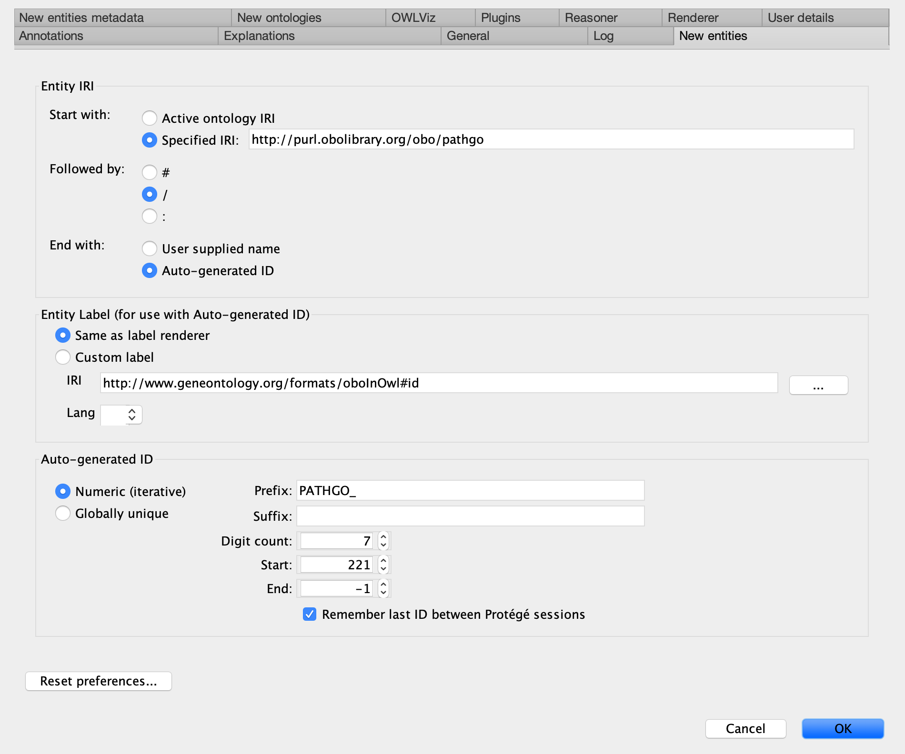

# PathGO: the Pathogenesis Gene Ontology

| | |
|---|---|
| Authors | Ron Jacak ([rjacak](https://github.com/rjacak)) |
| | Jody Proescher ([jproesch](https://github.com/jproesch)) |
| | Gene Godbold
| | Amanda Ernlund ([awe220](https://github.com/awe220)) |
| | Tina Zudock ([kzudock](https://github.com/kzudock)) |

## Description

This ontology contains terms to describe the function of genes and gene products involved in pathogenesis.  Genes that encode toxins, virulence factors, and antimicrobial resistance have functions that are not represented well by the terms contained within the Gene Ontology or any of the other OBO Foundry ontologies.  This ontology will collect and maintain common terms and descriptions of concepts related to pathogenesis, and could help provide more intuitive descriptions of function for these types of sequences.

## Contents

The PathGO project has the following filesystem structure:
.
├── CONTRIBUTING.md
├── README.md <-- file shown on main GitHub page
├── bin/ <-- utilities for managing ontology files
├── imports/ <-- imported ontologies live here
├── issue_template.md
├── pathgo.obo <-- distributable versions of the ontology (.obo, .owl)
├── pathgo.owl
├── src/
│   ├── metadata/
│   ├── ontology/
│   │   ├── Makefile
│   │   ├── last_used_id.txt <-- last used term id
│   │   ├── pathgo-edit.owl <-- working version of the ontologies, most recent updates live here
│   │   ├── pathgo-idranges.owl
│   │   ├── ...
│   └── sparql/
└── static/
    └── protege_new_entity_settings.png

## Versions

### Stable release versions

The latest official release of the ontology can always be found at:

[pathgo.owl]

If/when the ontology gets approved by the OBO Foundry, official releases will also be available at: 

http://purl.obolibrary.org/obo/pathgo.owl

### Editors' version

Changes made between official releases of the ontology can be found in the "-edit" file, [src/ontology/pathgo-edit.owl](src/ontology/pathgo-edit.owl).

## Workflow for viewing the ontology 

We recommend the use of GitHub Desktop (https://desktop.github.com/) and Protege (https://protege.stanford.edu/) for viewing the ontology. Individuals should download and install GitHub Desktop, select the option to "Clone a Repository from the Internet...", search for the "pathogenesis_gene_ontology" repository, and clone it.  When prompted, you will be able to choose where the cloned repository files are saved.  **Choose an alternate location or make note of the default location, because you will need this path working with the ontology.**  Our recommended workflow for viewing the ontology and making changes is as follows:

1. From within GitHub Desktop, ensure that the current repository selected is 'pathogenesis_gene_ontology'.
2. At the top of the main window, ensure that the "Current Branch" selected is 'master', and click "Fetch origin" to pull down the latest version of the ontology. 
3. Download and install Protege if not already available (https://protege.stanford.edu/)
4. From within Protege, open the ontology by navigating to the directory where the repository was cloned, descend into the 'src/ontology' folder, and open the [src/ontology/pathgo-edit.owl](src/ontology/pathgo-edit.owl) file.
5. Once you are done viewing the ontology, simply exit out of Protege and GitHub Desktop.  Make sure to click the "Fetch origin" button in GitHub Desktop each time prior to viewing the ontology in Protege, to ensure you are viewing the latest version.

## Suggesting edits

PathGO would welcome suggestions and contributions from the community!  Individuals can either A) recommend changes by creating an issue in the ontology project page on Github.com, or B) edit the pathgo-edit.owl file in a new branch in GitHub Desktop and petition for the changes to be merged into the official PathGO branch.

### A. Suggesting changes via Creating an Issue

1. From the ontology page in Github.com (https://github.com/jhuapl-bio/pathogenesis-gene-ontology), click the "Issues" tab, and then create a "New Issue". 
2. Enter suggested changes or comments into the text box and click "Submit new issue".

### B. Directly editing the ontology

Contributors are encouraged to use Protege for ontology editing, and a Git-enabled command line environment for version control and for submitting changes for integration.  Note, to edit this ontology, contributors should make changes to the "-edit" file, [src/ontology/pathgo-edit.owl](src/ontology/pathgo-edit.owl) **in a separate branch**, and create a pull request from that branch.

For contributors with less or no experience with Git and command line environments, we recommend the following workflow using GitHub Desktop (https://desktop.github.com/).  

1. From within GitHub Desktop, ensure that the current repository selected is 'pathogenesis_gene_ontology'.
2. At the top of the main window, ensure that the "Current Branch" selected is 'master', and click "Fetch origin" to pull down the latest version of the ontology.
3. Next, under the "Current Branch" menu, click the button to create a "New Branch", and give it a short name indicative of the changes you are making.
4. Click the button in the main window (or at the top menu bar) to publish the branch, which will create this branch in the GitHub repository.
5. Download and install Protege if not already available (https://protege.stanford.edu/)
6. From within Protege, open the ontology by navigating to the directory where the repository was cloned, descend into the 'src/ontology' folder, and open the [src/ontology/pathgo-edit.owl](src/ontology/pathgo-edit.owl) file. 
7. Update the settings for "New entities" in Protege as indicated in the [Protege Settings](#protege-settings) section below.  If you plan to suggest new terms for addition, you will need to determine the last numeric id currently used in the ontology (see [Determining the last used numeric id](#determining-the-last-used-numeric-id) below). 
8. Make desired edits/comments to the ontology in Protege and save the changes.
9. Switch back to the GitHub Desktop application, and review all of the changes present.  Any changes that you don't want to be retained should be removed in Protege.  Alternatively, if you want to start back over with the original version of a file, you can right-click on the file and select "Discard Changes...".
10. Save the changes to your local Git repository by providing a short name and description in the boxes at the bottom left corner, and clicking "Commit to -name of your branch-".  Note, this will only save the changes on your computer.
11. Save the changes to your branch in the GitHub repository by clicking the 'Push origin' button in the main window.  Note, this will just save the changes to your branch in GitHub, not to the official PathGO branch.
12. Submit a request for your changes to be included into PathGO.  Under the "Current Branch" menu, click the "Pull requests" tab, and click the "create a pull request" link in the middle of the box to create a pull request from the current branch.  This action will open a window to the ontology page at Github.com where you should click the green "Create pull request" at the bottom.  This action will trigger a notification, i.e. a pull request, to the maintainers of PathGO who will review the changes and incorporate them, if approved.  If not approved, you will have the opportunity to make additional changes, save them in Protege, commit them in GitHub Desktop, push them to the origin, and retry the pull request. 

#### Protege Settings

Current best ontology practices include identifying terms/classes with a Uniform Resource Identifier (URI).  PathGO is adopting the conventions that other ontologies within the OBO Foundry use including the use of Permanent URLs (PURLs) with a standard base prefix, as well as short-form identifiers (e.g. PATHGO:0000200) to identify terms.  Users should open the Protege Preferences pane and update the "New entities" tab with the following settings:

Ensure that under "Auto-generated ID", the Prefix is set to "PATHGO\_", the digit count is 7, and the start is set to the number of last used id.

#### Determining the last used numeric id

Instructions on how to determine last used numeric id are currently being drafted.  Users experienced with git should manually configure their git environment to use the git "hooks" located in .githooks, by executing the following command:
$ git config core.hooksPath .githooks
The post-receive hook therein will update the [src/ontology/last_used_id.txt](src/ontology/last_used_id.txt) file after any 'git push' commands.

## Contact

Please use this repository's [Issue tracker](https://github.com/rjacak/pathogenesis-gene-ontology/issues) to request provide feedback, recommend changes to terms/classes, and/or report errors or specific concerns related to the ontology.  We would love to hear from you!

## Acknowledgements

This ontology repository was created using the [ontology starter kit](https://github.com/INCATools/ontology-starter-kit).  We thank Chris Mungall and any other developers for putting this utility together.

## License
This material is licensed to the public under CC BY-NC 4.0.  The U.S. Government has “Unlimited Rights” as granted and defined under FAR 52.227-14.

## Copyright
©2020 The Johns Hopkins University Applied Physics Laboratory LLC (JHU/APL).  All Rights Reserved.

This material may be only be used, modified, or reproduced by or for the U.S. Government pursuant to the license rights granted under the clauses at DFARS 252.227-7013/7014 or FAR 52.227-14. For any other permission, please contact the Office of Technology Transfer at JHU/APL.

NO WARRANTY, NO LIABILITY. THIS MATERIAL IS PROVIDED “AS IS.” JHU/APL MAKES NO REPRESENTATION OR WARRANTY WITH RESPECT TO THE PERFORMANCE OF THE MATERIALS, INCLUDING THEIR SAFETY, EFFECTIVENESS, OR COMMERCIAL VIABILITY, AND DISCLAIMS ALL WARRANTIES IN THE MATERIAL, WHETHER EXPRESS OR IMPLIED, INCLUDING (BUT NOT LIMITED TO) ANY AND ALL IMPLIED WARRANTIES OF PERFORMANCE, MERCHANTABILITY, FITNESS FOR A PARTICULAR PURPOSE, AND NON-INFRINGEMENT OF INTELLECTUAL PROPERTY OR OTHER THIRD PARTY RIGHTS. ANY USER OF THE MATERIAL ASSUMES THE ENTIRE RISK AND LIABILITY FOR USING THE MATERIAL. IN NO EVENT SHALL JHU/APL BE LIABLE TO ANY USER OF THE MATERIAL FOR ANY ACTUAL, INDIRECT, CONSEQUENTIAL, SPECIAL OR OTHER DAMAGES ARISING FROM THE USE OF, OR INABILITY TO USE, THE MATERIAL, INCLUDING, BUT NOT LIMITED TO, ANY DAMAGES FOR LOST PROFITS.

